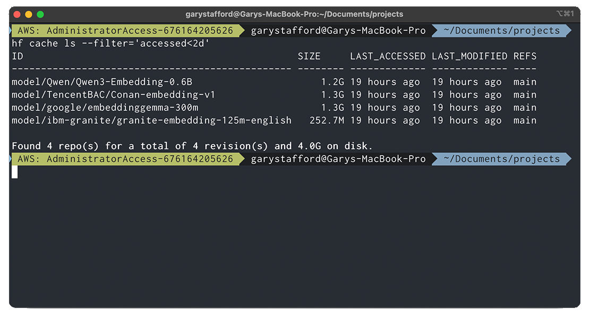
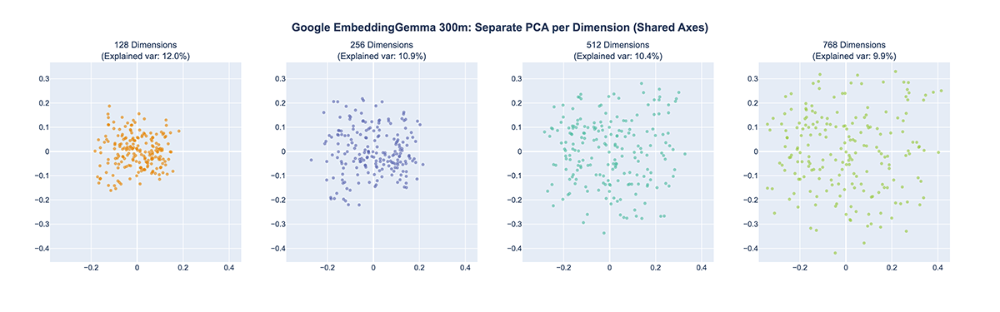
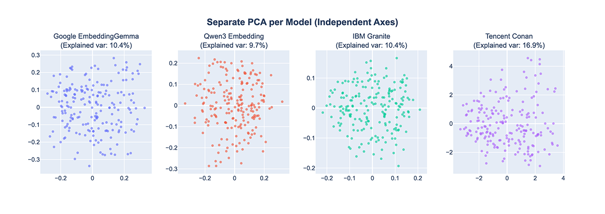

# Dense Vector Embedding Space Comparison

See the post, [Different Embedding Models, Different Spaces: The Hidden Cost of Model Upgrades](https://garystafford.medium.com/different-embedding-models-different-spaces-the-hidden-cost-of-model-upgrades-899db24ad233) for more details. A systematic comparison of four state-of-the-art text embedding models reveals why model switching degrades retrieval quality.

## Code

I recommend the latest [embeddings-comparison_v2.ipynb](./embeddings-comparison_v2.ipynb) notebook that leverages a newer and more diverse set of quotes to generate embeddings.

## Models

To illustrate this concretely, we can run a series of experiments with several popular, smaller, open-weight text embedding models, all available on Hugging Face.

- Qwen/Qwen3-Embedding-0.6B
- TencentBAC/Conan-embedding-v1
- google/embeddinggemma-300m
- ibm-granite/granite-embedding-125m-english



## Comparative Vector Spaces

All models are compatible with SentenceTransformers, a Python framework maintained by Hugging Face, for generating high-quality text (and some image) embeddings using transformer models. These embeddings power tasks like semantic search, retrieval-augmented generation (RAG), clustering, similarity, reranking, and more. This compatibility allows us to reuse the same code across models to create and use our embeddings. All you need is a free Hugging Face account with a User Access Token.





## Prerequisites

- Python 3.12+
- Hugging Face free account with [User Access Tokens](https://huggingface.co/docs/hub/en/security-tokens)

## Install Requirements (Mac with `pip`)

```bash
python -m pip install virtualenv --break-system-packages -Uq
python -m venv .venv
source .venv/bin/activate

plotly_get_chrome
```

## License

This project is licensed under the MIT License. See the [LICENSE](LICENSE) file for details.

## Disclaimer

The contents of this repository represent my viewpoints and not those of my past or current employers, including Amazon Web Services (AWS). All third-party libraries, modules, plugins, and SDKs are the property of their respective owners.
